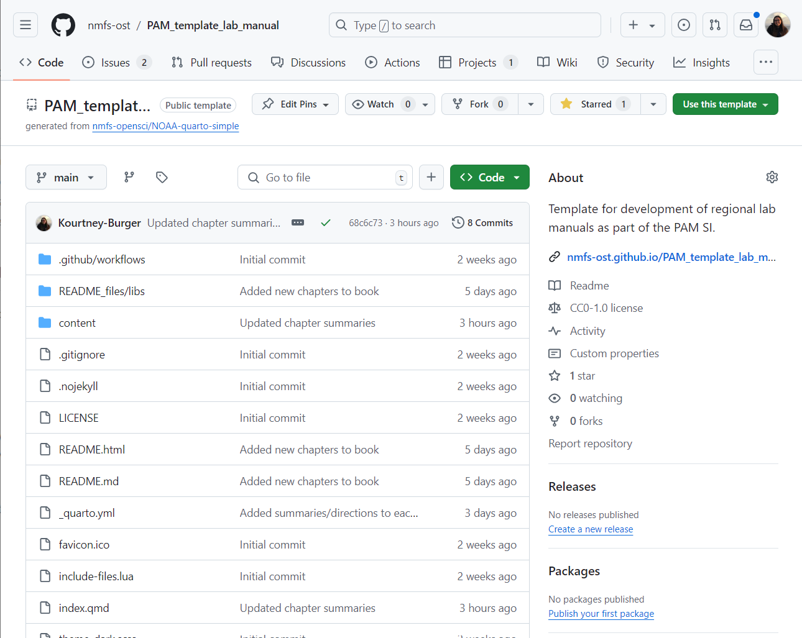
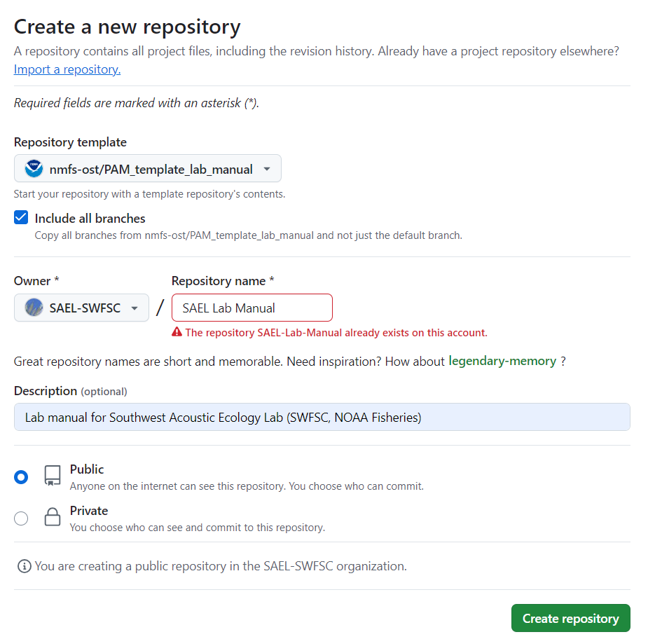
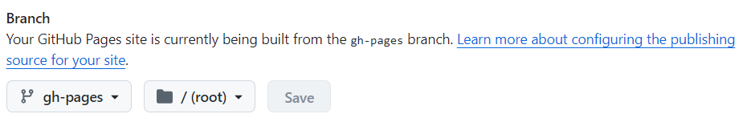
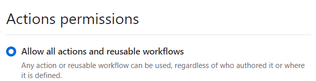
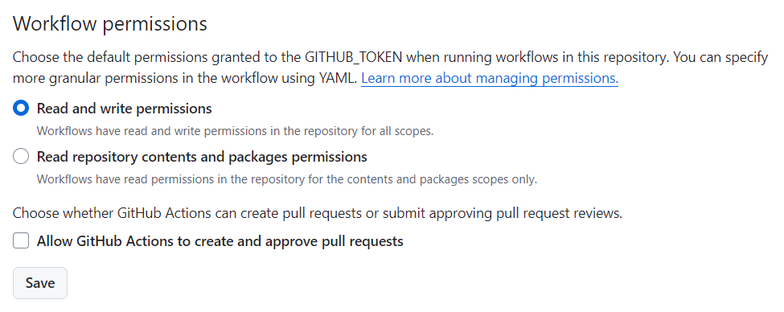
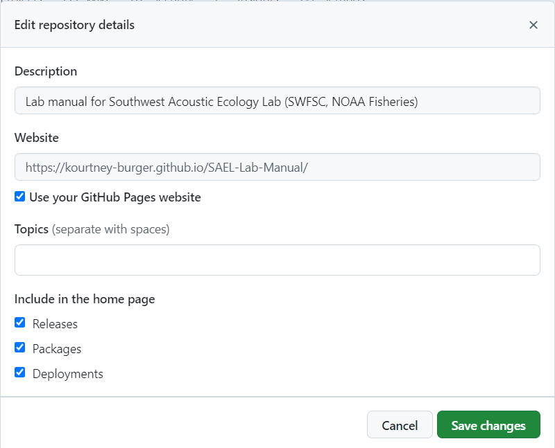

## Value Stream Management

Value Stream Management (VSM) is a practice used to visualize, measure, and improve the end-to-end delivery of a product or service. For scientific research purposes, we can think of this as our workflow.

In order to streamline this workflow, it helps to map out the steps, visualize the sticky points, and make incremental improvements towards a more efficient workflow.

These digital tools were designed to facilitate this process. Each section relates to a component of the Value Stream Management process and are intended to be implemented sequentially, however, each section can provide stand-alone value.

VSM Steps (sections):

1.  Family Process Matrix

2.  Current State Map

3.  Future State Map

4.  Gap Analysis

5.  Kaizen Bursts

6.  Rinse and Repeat

## How to Use this Tool
Under Construction! 
When Completed, this will serve as a template that users can readily adopt for their own needs. 

1.  Open [this repository on GitHub](https://github.com/shannonrankin/vsm-flowchart)

2.  Click on the 'Use this template' button in the top right, select 'Create new repository'

    

3.  Edit repository settings

    - Select the 'Include all branches' option

    - Select your lab organization or yourself as the owner and rename the repository (we recommend 'vsm-ProjectName')

    - Make description, for example: "Value Stream Management for 'insert Project Name'"

    - Make the repo public (to allow website to render)

      

4.  Click create repository

5.  Turn on GitHub pages under Settings-\>Pages. You will set pages to be made from the gh-pages branch and root directory

    

6.  Update 'Actions' settings

    - Under Settings -\> Actions -\> General -\> Actions permissions select 'Allow all actions and reusable workflows'. Select save

      {width="323"}

    - Under Settings -\> Actions -\> General -\> Workflow permissions select 'Read and write permissions'

      

      ::: callout-important
      ## Note: Both of these settings may already be selected but you have to click save for both
      :::

7.  Return to the main page of the repo to edit your website

    - Click on 'Code' in the top left

    - Click on the settings button next to the 'About' section on the right side of the repository

    - Select 'Use your GitHub Pages website'. This should autopopulate the website

    - Select 'Save Changes'

      

8.  Your VSM Flowchart is now created! You can now follow the directions provided on the site.

## Example VSMs
(none available yet!)
